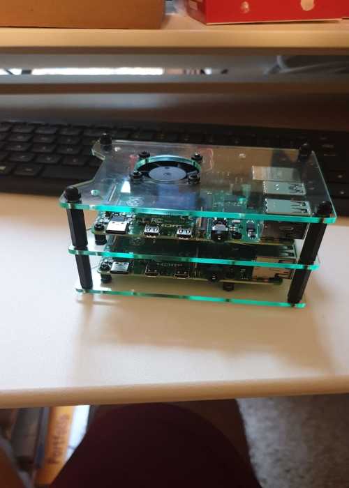

# Microservice Architecture with Multiple Languages

[](https://travis-ci.org/rodrigorodrigues/microservices-design-patterns)
[](https://codecov.io/gh/rodrigorodrigues/microservices-design-patterns)

The idea for this project is to show a case for applying `Microservice Architecture` using multiple languages.

Most of the services are in `Java + Spring Boot 2 + MongoDB` but there are others using `NodeJS, Kotlin, Python and Go`.

The web application is using `React` 

Android App using `React Native` working in progress.

Docker images are built in multiple platforms(`linux/amd64,linux/arm64`).

Services are deployed in a Raspberry Pi Cluster to access https://spendingbetter.com and create a user.



Feel free to create a new microservice using a different language(`Ruby?, C#?`), just please following the minimal requirements:
 * Create a new folder on root and put your code
 * Add a minimal documentation
 * Add a Rest API
 * Add JWT Validation
 * Add Tests
 * Add Dockerfile
 * Add MongoDB or some other NoSql
 * Add Consul Client(if possible)

PS: A better approach would be a microservice per repository but for simplicity all microservices are in the same repo.

If you want to contribute please check [TODO List](#todo-list).

Inspired by the book [Microservices Patterns](https://www.manning.com/books/microservices-patterns)(`Chris Richardson - @crichardson`).

## Contents

  1. [Microservice Patterns](#microservice-patterns)
  2. [Prerequisites](#prerequisites)
  3. [Microservice Diagram](#microservice-diagram)
  4. [Installing all services using Docker Compose](#installing-all-services-using-docker-compose)
  5. [Docker Commands](#docker-commands)
  6. [Manual Installation - NOT RECOMMENDED](#manual-installation---not-recommended)
  7. [Accessing React Web App](#accessing-react-app)
  8. [List of default users](#default-users)
  9. [Kubernetes - Google Cloud Platform](#kubernetes---google-cloud-platform)
  10. [~~Travis CI/CD~~](#travis-cicd)
  11. [Github Actions CI/CD](#github-actions-cicd)
  12. [OS Native App - GRAALVM](#graalvm)
  13. [TODO List](#todo-list)
  14. [References](#references)
  15. [Postman Collection](docs/postman_collection.json?raw=true)

### Microservice Patterns

The following list of `Microservice Patterns` was applied so far.

 * **Server-side service discovery** - [Consul](https://www.consul.io/)
 
 * **API Gateway** - [Spring Cloud Gateway](https://spring.io/projects/spring-cloud-gateway)
 
 * **Externalized configuration** - [Consul](https://www.consul.io/) using `Spring Cloud Config` yaml format(with spring profiles), more details look at [docker/spring-cloud-config](docker/spring-cloud-config) 
 
 * **Exception Tracking** - [Spring Boot Admin](https://codecentric.github.io/spring-boot-admin/current/)
 
 * **Access token** - [Spring Oauth2 with JWT](https://spring.io/projects/spring-security-oauth)
 
 * **Health Check API** - [Spring Boot Actuator Starter](https://docs.spring.io/spring-boot/docs/current/reference/htmlsingle/#production-ready) 
 
 * **Distributed tracing** - [Jaeger](https://www.jaegertracing.io/)
 
 * **Application metrics** - [Spring Micrometer Prometheus](https://spring.io/blog/2018/03/16/micrometer-spring-boot-2-s-new-application-metrics-collector)
 
 * **Database per service** - [MongoDB](https://www.mongodb.com/) an instance per service
 
 * **Shared database** - [Redis](https://redis.io/) for sharing http sessions
 
To know more about each pattern look at [Microservice Architecture](https://microservices.io/patterns/microservices.html)

### Prerequisites
 * JDK 1.8
 * Maven 3
 * Docker 17.05.0-ce+ - `Not necessary but recommended otherwise the services should run by command`
 * Docker Compose 1.23.2 - `Not necessary but recommended otherwise the services should run by command`

### Microservice Diagram
 
 

### Installing All Services using Docker Compose

The easiest way to run all microservices is using `docker-compose`, run the following commands:

On `root folder` first need to generate the docker images.

```bash
# at once to compile code
mvn clean install 

# to build the docker images on Linux
mvn clean package -Pnative

# to build the docker images on Mac M1 Apple Silicon
mvn clean package docker:build
```
PS: `Spring Native` does not support yet Mac M1 Apple Silicon([Issue](https://github.com/tendermint/starport/issues/1110))

On `docker folder` run all microservices

```bash
docker-compose up -d
```

### Docker Commands

To see logs for a specific docker container:

```bash
docker logs -f SERVICE_NAME
```

PS: Service names are on `docker-compose.yml -> container_name`

To execute a command inside the container:

```bash
docker exec -it week-menu-api sh
```

To stop and remove all containers:
```bash
docker-compose down -v
```

To restart/start/stop/remove specific container:

```bash
docker-compose restart SERVICE_NAME
docker-compose up SERVICE_NAME
docker-compose stop SERVICE_NAME
docker-compose rm SERVICE_NAME
```

### Manual Installation - NOT RECOMMENDED

If for some reason you cannot install `docker/docker-compose` you can run all services manually using the following command for `Java` applications.

`mvn spring-boot:run -Dspring-boot.run.arguments="--server.port={PORT}"`

To run `NodeJS and React` applications on folders `nodejs-service and react-webapp`:

```
sudo npm install

sudo npm start
```

### Accessing React App

To access [React Web App](http://localhost:3000).


### Default Users

~~Following the list of default users:~~

```
admin@gmail.com/password - ROLE_ADMIN

master@gmail.com/password123 - ROLE_PERSON_CREATE, ROLE_PERSON_READ, ROLE_PERSON_SAVE

anonymous@gmail.com/test - ROLE_PERSON_READ
```
PS: Moved default users for Integration Tests only.

### Kubernetes - Google Cloud Platform

The code in `Raspberry Pi Cluster using microk8s`.

Following useful commands for kubernetes

Installation

```
#helm create ingress - RBAC enabled
kubectl create serviceaccount --namespace kube-system tiller
kubectl create clusterrolebinding tiller-cluster-rule --clusterrole=cluster-admin --serviceaccount=kube-system:tiller
helm init --service-account tiller
helm list
helm init --tiller-tls-verify
helm init
kubectl get deployments -n kube-system
helm install --name nginx-ingress stable/nginx-ingress --set rbac.create=true --set controller.publishService.enabled=true

#helm list
helm list

#create tls
kubectl create secret tls ingress-tls --cert /etc/sslmate/www.spendingbetter.com.chained.crt --key /etc/sslmate/www.spendingbetter.com.key

#create generic certs
kubectl create secret generic spendingbetter-p12 --from-file=/etc/sslmate/www.spendingbetter.com.p12
kubectl create secret generic spendingbetter-crt --from-file=/etc/sslmate/www.spendingbetter.com.crt
kubectl create secret generic spendingbetter-jks --from-file=/etc/sslmate/www.spendingbetter.com.jks

#list certs
kubectl get secrets

#list specific cert
kubectl describe secret ingress-tls

#show ingress
kubectl get ing
kubectl describe ingress


# Istio
# Get Grafana Configuration
kubectl get service grafana --namespace istio-system -o yaml

# Update Grafana Configuration
kubectl edit service grafana --namespace istio-system
```

Deployment

```
cd kubernetes

#create docker image


docker tag docker_react-webapp:latest eu.gcr.io/spring-boot-gke-243520/react-webapp:6.0

#push docker image
docker push eu.gcr.io/spring-boot-gke-243520/eureka-server:4.0
docker push eu.gcr.io/spring-boot-gke-243520/react-webapp:6.0

#Deploy
kubectl apply -f deployment-admin-server.yml

#Undeploy
kubectl delete -f deployment-admin-server.yml

#see logs
kubectl logs admin-server-XXXXX -f

#exec command
kubectl exec -it redis-5b4699dd74-qckm9 -- sh

#show all pods
kubectl get pods --show-labels

#create config map
kubectl create configmap prometheus --from-file=../docker/prometheus-prod.yml

kubectl create configmap grafana-dashboard --from-file=../docker/create-datasource-and-dashboard.sh

kubectl create configmap grafana-datasource --from-file=../docker/grafana-datasource.yaml

#port forward
kubectl port-forward $(kubectl get pod --selector="app=eureka-server" --output jsonpath='{.items[0].metadata.name}') 8761:8761

#delete specific ingress
kubectl delete ingress ingress-gateway-forward-https

#cpu usage
kubectl get nodes --show-labels
kubectl describe nodes gke-your-first-cluster
kubectl top nodes
```

[Enable Ingress](https://cloud.google.com/community/tutorials/nginx-ingress-gke)

[Example Ingress Configuration](https://github.com/GoogleCloudPlatform/community/blob/master/tutorials/nginx-ingress-gke/ingress-resource.yaml)

[Install Helm](https://helm.sh/docs/using_helm/#installing-helm)

[Kubernetes + Zuul](https://stackoverflow.com/questions/52066141/zuul-unable-to-route-traffic-to-service-on-kubernetes)

[Example Spring Boot 2 + Kubernetes + Zuul](https://piotrminkowski.wordpress.com/2018/08/02/quick-guide-to-microservices-with-kubernetes-spring-boot-2-0-and-docker/)

[Secure Discovery Example](https://piotrminkowski.wordpress.com/2018/05/21/secure-discovery-with-spring-cloud-netflix-eureka/)

### Travis CI/CD

Used [travis-ci](https://travis-ci.org) for building `pull requests` only.


### Github Actions CI/CD

Using `GitHub Actions` for deploying services for multiple platforms(`linux/amd64,linux/arm64`).

More details look at [.github/workflows/docker-build-push-*](.github/workflows).

Configuration(`Deployment/Services`) for Kubernetes look at [.github/workflows/kubernetes](.github/workflows/kubernetes).

### GRAALVM

First need to compile project

`mvn clean package`

To run an app native using Spring Native

`
mvn spring-boot:build-image -pl authentication-service
`

PS: Valid modules are `authentication-service, person-service, user-service, kotlin-service, edge-server and edge-server`.

Or to run with GraalVM Plugin.
`
mvn package -Pnative -q -pl authentication-service -am -B -Dorg.slf4j.simpleLogger.log.org.apache.maven.cli.transfer.Slf4jMavenTransferListener=warn -DskipTests
`

To run the os native app

`
SPRING_PROFILES_ACTIVE=consul,dev SPRING_CLOUD_KUBERNETES_ENABLED=false CONSUL_URL=localhost:8501 authentication-service/target/authentication-service
`

### Swagger UI

Swagger UI is available for `Authentication, Person and User Services`

Access it [Swagger UI](http://localhost:{SERVICE_PORT}/swagger-ui.html) - `http://localhost:{SERVICE_PORT}/swagger-ui.html`

### TODO List

* [X] Java - Split Person and User in different entities
* [X] Java - Split back-end and front-end in two different folders
* [X] Java - Split Java 8 Learning in another folder
* [X] Java - Add Test for Users Classes
* [X] Java - Add Spring Cloud Config
* [X] Java - Add Service Discovery(Eureka)
* [X] Java - Add Zuul(Gateway)
* [X] Java - Add Maven Docker Plugin
* [X] Java - Add Redis for Shared Session between applications
* [X] Java - Add Authentication for all applications
* [X] Java - Add Prometheus/Grafana for docker compose
* [X] Java - Add Oauth2 Security layer
* [X] Java - Fix Zuul/Edge Server for working with NodeJS Service
* [X] Kotlin - Add Service using Kotlin Language
* [X] Quarkus - Add Service using Quarkus framework
* [ ] Scala - Add Service using Scala Language
* [ ] C# - Add Service using C# Language
* [X] Go - Add Service using Go Language
* [X] React - Create User List
* [X] React - Create User Page
* [X] React - Create User Edit
* [X] React - Create Categories Edit
* [ ] React - Create Recipes Edit
* [X] React - Fix User Create/Edit
* [X] React - Fix Person Create/Edit
* [ ] React - Fix Person List to work with `@Tailable` and `EventSource`.
* [X] React - Fix Docker Web App to use Nginx
* [ ] Kubernetes/Minikube - Add example to use Kubernetes with Minikube
* [X] Deploy - Google Cloud/GKE
* [X] CI/CD - Add Travis
* [ ] ~~CI/CD -  - Add Herokuy~~
* [X] CI/CD - Add GitHub Actions for deploy in GCP
* [ ] Add documentation for libraries used
* [ ] Add documentation/how-to for each language
* [ ] Add tests for Python
* [ ] Add React Legacy
* [X] Rename `/api/persons` to `/api/people`
* [X] Replace Eureka/Spring Config Server to Consul
* [X] Add Query DSL
* [X] Java - Migrate Zuul to Spring Cloud Gateway
* [ ] React - Need to fix new layout
* [X] Go - Fix call to another service
* [ ] PHP - Add Service using PHP/Laravel
* [X] Java - Migrate JDK 21 - Spring Boot 3
* [X] Java - Migrate JDK 21 - Quarkus 3
* [X] Java - Add Passkeys - Spring Boot 3
* [X] Java - Add One Time Token - Spring Boot 3
* [X] Java - Add JWKS Multiple Validation - Spring Boot 3
* [X] Java - Add Authorization Server - Spring Boot 3
* [X] Java - Removed Spring Oauth2 - Spring Boot 3
* [] BFF - Implement BFF Pattern
* [X] Java - Spring Boot 4/JDK 25
* [X] Java - Add TestContainers

### References
[Pattern Microservice Architecture](https://microservices.io/patterns/microservices.html)

[Spring Guide](https://spring.io/guides)

[Spring Boot](https://start.spring.io)

[React ad Spring WebFlux](https://developer.okta.com/blog/2018/09/25/spring-webflux-websockets-react)

[Spring WebFlux Security Jwt](https://github.com/raphaelDL/spring-webflux-security-jwt)

[Junit 5](https://medium.com/@GalletVictor/migration-from-junit-4-to-junit-5-d8fe38644abe)

[Keytool Commands](https://www.sslshopper.com/article-most-common-java-keytool-keystore-commands.html)

[Spring Boot Kotlin Example](https://github.com/spring-petclinic/spring-petclinic-kotlin)

[Istio with SDS - Manual Instalation](https://github.com/knative/docs/blob/master/docs/install/installing-istio.md#installing-istio-with-SDS-to-secure-the-ingress-gateway)

[Istio on GKE](https://cloud.google.com/istio/docs/istio-on-gke/overview)

[Istio Gateway](https://medium.com/@tufin/test-7daa5ee3782b)

[Automatic Deployment using Travis and GKE](https://engineering.hexacta.com/automatic-deployment-of-multiple-docker-containers-to-google-container-engine-using-travis-e5d9e191d5ad)

[Microprofile with Metrics](https://kodnito.com/posts/getting-started-with-microprofile-metrics-and-prometheus/)

[Go with MongoDB](https://medium.com/dev-howto/how-to-use-go-with-mongodb-using-official-mongodb-go-driver-76c1628dae1e)

[Go Echo Rest Api](https://echo.labstack.com/)

[Go Tutorial](https://tour.golang.org/list)

[Go Consul](http://varunksaini.com/consul-service-discovery-golang/)

[Raspberry Pi Cluster](https://ubuntu.com/tutorials/how-to-kubernetes-cluster-on-raspberry-pi#1-overview)

[Spring Cloud Gateway](https://spring.io/projects/spring-cloud-gateway)

[Spring Cloud Gateway Filters](https://www.baeldung.com/spring-cloud-custom-gateway-filters)

[Quarkus Custom Dockerfile](https://vividcode.io/optimize-quarkus-jvm-container-image-size/)